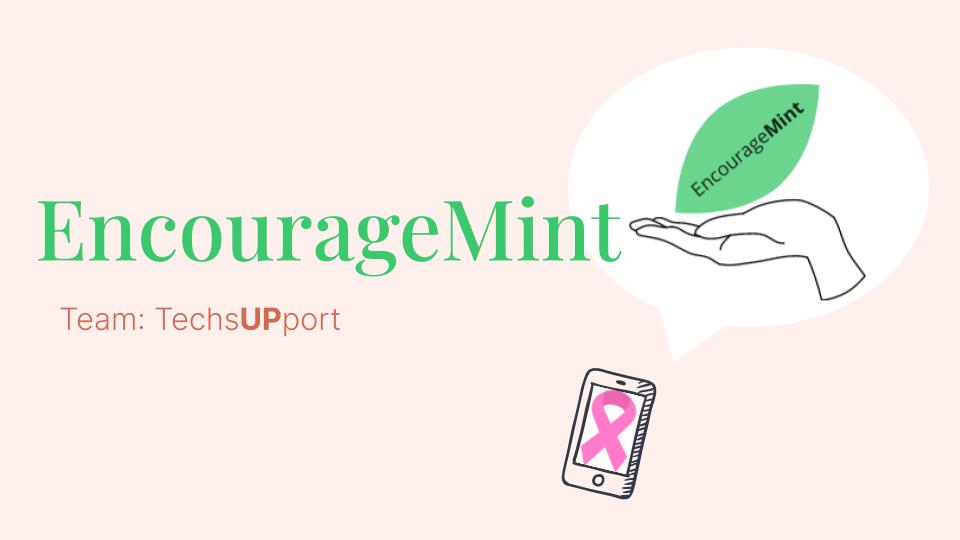
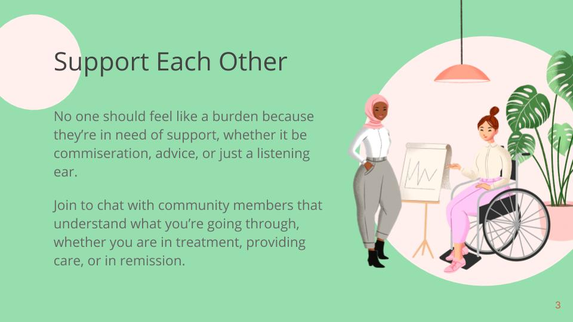
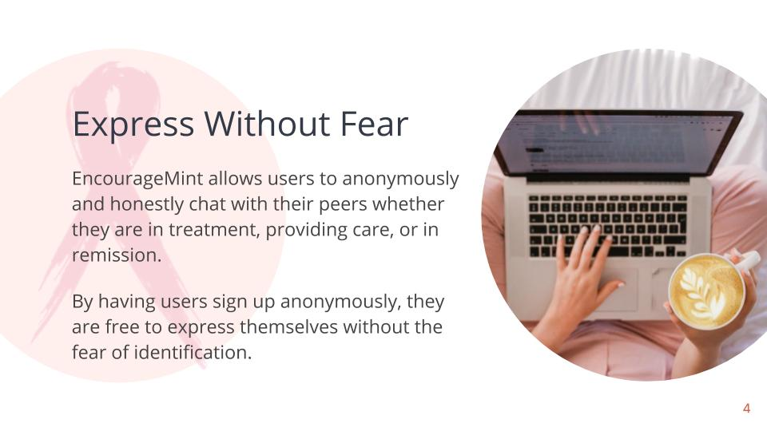
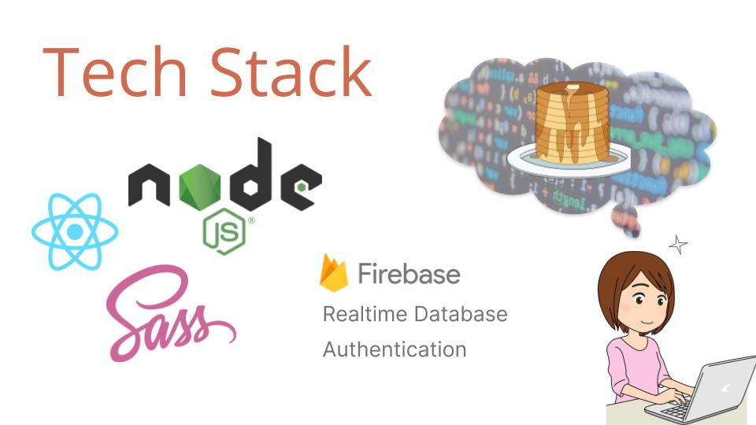

# 💚 EncourageMint 💚



### **ELCHackathon Hack for Pink Submission**

EncourageMint is a Progressive Web App (PWA) built to connect community members affected by breast cancer, whether they're providing care, experiencing treatment, or in remission.

---

## 👩‍💻👩‍💻 Engineering Team 👩‍💻👩‍💻


| Engineer | LinkedIn Profile | GitHub Profile |
| ----------------- | ------------------------------------------------ | ------------------------------- |
| ☀️ Ariel Ng | https://www.linkedin.com/in/arielng/ | https://github.com/arng0123 |
| ☀️ Emma Seely-Katz | https://www.linkedin.com/in/emmask/ | https://github.com/emseely |
| ☀️ Kristi Nanco | https://www.linkedin.com/in/knanco/ | https://github.com/knanco |
| ☀️ Taihua Rubin | https://www.linkedin.com/in/taihuarubin/ | https://github.com/TaihuaRubin |

---

## ⛈ Prompt

Breast cancer is the most commonly occurring cancer in women and the second most common cancer overall. As of january 2020, there are more than 3.5 million women with a history of breast cancer in the U.S. Breast cancer affects not only the patient, but also the people who care about them.

---

## 🧚‍♀️ How Can EncourageMint Help?


The guiding belief behind EncourageMint is that no one should feel like a burden because they are in need of support, whether it be commiseration, advice, or just a listening ear.

Join now to chat with community members that understand what you’re going through whether you are in treatment, providing care, or in remission.

---

## 🗣👂 Anonymous Listening Ear



EncourageMint allows users to anonymously and honestly chat with their peers whether they are in treatment, providing care, or in remission. By having users sign up anonymously, they are free to express themselves without the fear of identification.

---

## 💻 🥞 Tech Stack:


This is a non-exhaustive list of the technologies we used to build EncourageMint.
This project was bootstrapped with [Create React App](https://github.com/facebook/create-react-app).

---

## 🖼 Project Presentation:

[ 📺 Watch the Video presentation](https://www.youtube.com/watch?v=Ouzqb7u53mI&feature=emb_title)

[🦾 Check out our DevPost Submission](https://devpost.com/software/encouragemint-35p2l4)

[🍔 Take a look at the slides](https://docs.google.com/presentation/d/e/2PACX-1vS79YwMNfeZe9vYfeUxBCbXgjQJInWpkHoRqkA6rZMQpNMuVNI2QVQqedWMu-mtbPTFhPiYCCr2kqbC/pub?start=true&loop=false&delayms=3000&slide=id.g9b6d072362_5_13)

[👩‍🚒 Learn how we planned the project](https://miro.com/app/board/o9J_kmIVq7M=/)

---

## 👾 How to Use this Repository?

```shell
git clone https://github.com/tech-support-ELC/EncourageMINT.git
npm install
npm start
```
